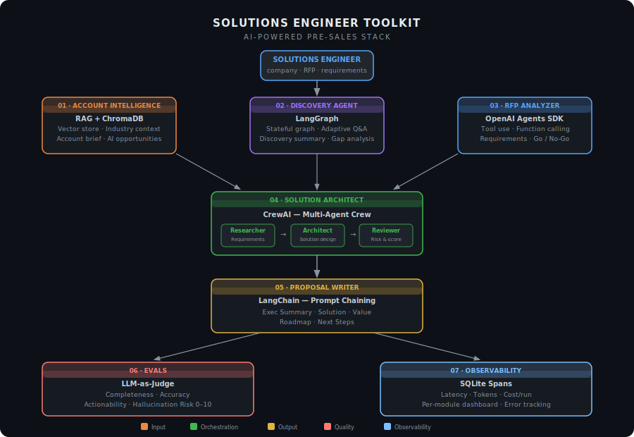
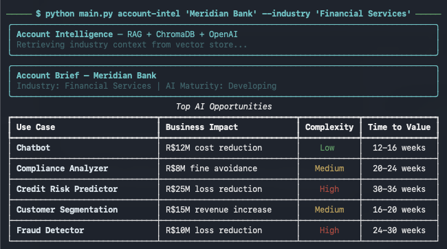

# Solutions Engineer Toolkit

**A suite of AI-powered tools that empowers Solutions Engineers to deliver results no human SE can achieve alone — built on the agentic AI stack that Google, NVIDIA, and OpenAI deploy in production.**

---

## The Problem It Solves

A senior Solutions Engineer juggles five distinct workflows in every enterprise deal:

| Workflow | Without AI | With This Toolkit |
|----------|-----------|------------------|
| Account research before a meeting | 2–3 hours manually | 60 seconds with RAG |
| Discovery session quality | Depends on SE's experience | Adaptive AI-guided questioning |
| RFP analysis | 3–6 hours reading + extracting | Under 90 seconds |
| Architecture recommendation | Senior SE + 2-day whiteboard session | Multi-agent crew in minutes |
| Proposal writing | 4–8 hours drafting | LangChain prompt chain, 5 sections |
| Output quality assurance | Manual review — inconsistent | LLM-as-judge eval, scored 0–10 |
| Cost & latency visibility | None | SQLite observability dashboard |

**This toolkit does not replace the SE. It removes the low-value work so the SE can focus on what only humans can do: build trust, navigate politics, and close.**

---

## Tech Stack

Each module demonstrates a different framework from the enterprise agentic AI stack:

| Module | Framework | Why This Framework |
|--------|-----------|-------------------|
| Account Intelligence | **RAG + ChromaDB** | Retrieval-augmented generation grounds analysis in industry knowledge — no hallucination |
| Discovery Agent | **LangGraph** | Stateful multi-turn conversation with adaptive branching — the graph persists session context |
| RFP Analyzer | **OpenAI Agents SDK** | Native tool use with function calling — the agent orchestrates 3 specialized tools sequentially |
| Solution Architect | **CrewAI** | Multi-agent crew (Researcher → Architect → Reviewer) with role-based specialization |
| Proposal Writer | **LangChain** | Prompt chaining with output parsers — each section builds on context from the previous |
| **Evals** | **LLM-as-judge** | Automated quality scoring on 4 dimensions — separates demos from production-ready systems |
| **Observability** | **SQLite + custom spans** | Latency, token usage, and cost tracking per module — no external service required |

---

## Architecture



---

## Preview



---

## Quick Start

```bash
git clone https://github.com/fabricioartur/solutions-engineer-toolkit.git
cd solutions-engineer-toolkit
python -m venv .venv && source .venv/bin/activate
pip install -r requirements.txt

cp .env.example .env   # add your OPENAI_API_KEY
```

---

## Module 1 — Account Intelligence
### RAG + ChromaDB + OpenAI

Researches a company and generates a structured pre-meeting brief enriched with industry knowledge from a local vector store.

```bash
python main.py account-intel "Meridian Bank" \
  --industry "Financial Services" \
  --output output/account.json
```

**Output:** Account brief with company overview, top AI opportunities ranked by ROI, key stakeholders with engagement tips, recommended opening questions, and known objections.

**How RAG works here:** A ChromaDB collection is seeded with industry knowledge documents (`knowledge_base/`). Before calling the LLM, the agent retrieves the 3 most relevant documents for the company + industry query. The retrieved context is injected into the prompt — grounding the analysis in real industry patterns rather than generic LLM output.

**Sample output — Meridian Bank:**

| AI Opportunity | Business Impact | Complexity | Time to Value |
|----------------|----------------|------------|---------------|
| KYC Document Intelligence | Save 900+ analyst hours/month — R$4.2M/year | Medium | 10-14 weeks |
| WhatsApp Virtual Assistant | 50-60% call deflection — R$8.1M/year savings | Medium | 12-16 weeks |
| Regulatory Reporting (BACEN) | 3 weeks → 3 days per quarter | High | 20-26 weeks |
| Credit Risk Enhancement | Reduce NPL rate by 1.2-1.8pp — R$12M/year | High | 24-32 weeks |
| SME Financial Advisory AI | +18% product attachment rate — R$5.6M/year | Medium | 16-20 weeks |

---

## Module 2 — Discovery Agent
### LangGraph stateful multi-turn conversation

Conducts an AI-powered discovery session. The agent adapts its questions based on previous answers, tracks which dimensions have been covered, and stops when it has sufficient depth to generate a structured summary.

```bash
python main.py discovery \
  --context "Brazilian bank, 50k employees, evaluating AI for customer service" \
  --output output/discovery.json
```

**How LangGraph works here:** The conversation is modeled as a graph with two nodes — `se_agent` (LLM call) and `human_input` (terminal input). State persists across turns: the agent knows which of 7 discovery dimensions it has covered and uses that to decide the next question. When coverage is sufficient, the graph transitions to `END` and outputs a structured JSON summary.

```
DiscoveryState
├── messages: list[BaseMessage]     ← full conversation history
├── dimensions_covered: int         ← tracks discovery progress
└── complete: bool                  ← graph termination signal

Graph:
  START → se_agent → (complete?) → END
                   ↘ human_input → se_agent
```

**Sample output — Meridian Bank:**

```json
{
  "discovery_quality_score": 81,
  "summary": "Strong opportunity with CDO sponsorship and R$15M pre-approved budget...",
  "gaps": [
    "KYC document quality not assessed",
    "WhatsApp intent breakdown not confirmed",
    "IT security approval timeline unknown"
  ],
  "recommended_next_questions": [
    "Can you share anonymized KYC samples for POC scoping?",
    "What are the top 5 WhatsApp intents by volume?"
  ]
}
```

---

## Module 3 — RFP Analyzer
### OpenAI Agents SDK with function calling

Analyzes procurement documents using the OpenAI Responses API with native tool use. The agent orchestrates three specialized tools in sequence — without the caller managing the loop.

```bash
python main.py rfp-analyze input/rfp.pdf \
  --output output/rfp_analysis.json
```

**How tool use works here:** Three tools are registered: `extract_requirements`, `identify_risks`, and `generate_go_no_go`. The agent decides the order and parameters. The Responses API returns `tool_calls` outputs; the client executes them and feeds results back. The loop continues until the agent produces a final JSON summary.

```
Agent loop:
  1. extract_requirements(document_text) → requirements[]
  2. identify_risks(document_text) → risks[]
  3. generate_go_no_go(requirements, risks) → recommendation
  4. Final response: complete structured analysis
```

**Output includes:**
- Requirements matrix (Technical, Commercial, Security, Legal, Compliance)
- Risk register with probability, impact, and mitigation
- GO / CONDITIONAL GO / NO-GO recommendation with rationale
- Clarification questions for the customer

---

## Module 4 — Solution Architect
### CrewAI multi-agent crew

Three specialized agents collaborate sequentially to produce a validated architecture recommendation. Each agent has a distinct role, backstory, and goal — and can only access outputs from agents that ran before it.

```bash
python main.py architect \
  --requirements "RAG pipeline for 10M financial documents, SOC2 required, AWS-only" \
  --context "Brazilian bank, data residency in Brazil mandatory" \
  --output output/architecture.json
```

**How CrewAI works here:**

```
Crew (sequential process):
  ┌─────────────────────────────────┐
  │ Agent 1: Technical Researcher   │
  │ Goal: Analyze requirements and  │
  │ identify core constraints       │
  └────────────┬────────────────────┘
               │ output →
  ┌────────────▼────────────────────┐
  │ Agent 2: Principal Architect    │
  │ Goal: Design pragmatic solution │
  │ architecture with phased plan   │
  └────────────┬────────────────────┘
               │ output →
  ┌────────────▼────────────────────┐
  │ Agent 3: Solution Reviewer      │
  │ Goal: Validate feasibility,     │
  │ identify risks and gaps         │
  └─────────────────────────────────┘
```

**Sample output — Meridian Bank architecture score: 84/100**

---

## Module 5 — Proposal Writer
### LangChain prompt chaining

Consolidates outputs from all previous modules into a polished, customer-ready proposal. Each of the 5 sections is generated by a dedicated LangChain prompt chain, with context passed between sections.

```bash
python main.py proposal \
  --account-brief output/account.json \
  --discovery output/discovery.json \
  --architecture output/architecture.json \
  --output output/proposal.md
```

**How LangChain chaining works here:**

```python
chain = ChatPromptTemplate.from_template(section_prompt) | llm | StrOutputParser()
```

Five chains run in sequence. Each section prompt receives the relevant context from previous modules. The output is a structured Markdown document ready to share with the customer.

**Generated sections:**
1. Executive Summary — business-language overview tailored to the customer's challenges
2. Solution Overview — non-technical description of the proposed architecture
3. Business Value — quantified ROI and strategic value
4. Implementation Roadmap — phased plan with milestones and success criteria
5. Next Steps — action items, open questions, and decision timeline

---

## Module 6 — Evals
### LLM-as-judge output quality scoring

Evaluates any module output on four dimensions using the model as its own judge. This is the standard eval pattern used by OpenAI, Google, and Anthropic to measure output quality at scale — without human reviewers in the loop.

```bash
python main.py eval \
  --module account-intel \
  --input output/account.json \
  --output output/eval_account.json
```

**Four dimensions scored 0–10:**

| Dimension | What it measures |
|-----------|-----------------|
| **Completeness** | Are all fields populated with substantive content? |
| **Accuracy** | Is the content internally consistent and grounded? |
| **Actionability** | Can an SE use this output in a customer meeting tomorrow? |
| **Hallucination Risk** | Does the output contain unsupported specific claims? |

**Sample eval — Meridian Bank Account Brief:**

```
┌─────────────────────────────────┐
│  Grade: B  │  Score: 8.5/10    │
│  Production ready: ✓ Yes        │
└─────────────────────────────────┘

Dimension          Score    Justification
Completeness       9/10     All fields populated — 5 opportunities, 4 stakeholders
Accuracy           8/10     ROI figures clearly marked as estimates
Actionability      9/10     Questions specific to financial services, ready to use
Hallucination Risk 8/10     Minor: ROI numbers appear model-generated, not sourced

Top strength:    Stakeholder tips and opening questions are highly specific
Top improvement: Add confidence levels to ROI estimates before sharing
```

---

## Module 7 — Observability
### SQLite-backed span tracking

Every module execution is recorded as a span: latency, token usage, cost estimate, and status. No external service required — data lives in a local SQLite file.

```bash
# After running any modules:
python main.py metrics
```

**Sample dashboard:**

```
SE Toolkit — Observability Dashboard
┌──────────────────────┬──────┬─────────────┬───────────────┬──────────────────┬────────┐
│ Module               │ Runs │ Avg Latency │ Total Tokens  │ Total Cost (USD) │ Errors │
├──────────────────────┼──────┼─────────────┼───────────────┼──────────────────┼────────┤
│ solution-architect   │    3 │     42,180ms│        28,440 │          $0.0284 │      0 │
│ account-intel        │    8 │      6,320ms│        19,200 │          $0.0096 │      0 │
│ rfp-analyzer         │    2 │     18,740ms│        31,100 │          $0.0156 │      0 │
│ discovery            │    5 │     12,600ms│        14,800 │          $0.0074 │      1 │
│ proposal-writer      │    2 │     24,300ms│        22,600 │          $0.0113 │      0 │
└──────────────────────┴──────┴─────────────┴───────────────┴──────────────────┴────────┘

Total cost across all runs: $0.0723 USD
```

**Why this matters in production:** Without observability, you cannot answer "how much did this customer run cost?", "which module caused the timeout?", or "what's our p95 latency?" — the three questions every engineering leader asks before approving production deployment.

---

## Full Example: Meridian Bank

The `examples/meridian_bank/` directory contains pre-generated outputs for a complete fictional enterprise account — a Brazilian bank evaluating AI for customer service, compliance, and credit risk.

```bash
# Run any module against the example context
python main.py account-intel "Meridian Bank" --industry "Financial Services"
python main.py discovery --context "$(cat examples/meridian_bank/context.txt)"
```

**Pre-generated outputs:**
- [`01_account_brief.json`](examples/meridian_bank/outputs/01_account_brief.json) — Account intelligence with 5 AI opportunities and ROI estimates
- [`02_discovery_summary.json`](examples/meridian_bank/outputs/02_discovery_summary.json) — Discovery summary with 81/100 quality score
- [`03_architecture.json`](examples/meridian_bank/outputs/03_architecture.json) — 3-phase architecture recommendation scored 84/100 by the reviewer agent

---

## Project Structure

```
solutions-engineer-toolkit/
├── main.py                           # Unified CLI (Click)
├── requirements.txt
├── requirements-dev.txt
├── .env.example
├── .github/
│   └── workflows/ci.yml              # GitHub Actions: lint + test + type-check
├── tools/
│   ├── config.py                     # Shared Config dataclass
│   ├── account_intelligence/
│   │   └── agent.py                  # RAG + ChromaDB + OpenAI
│   ├── discovery_agent/
│   │   └── agent.py                  # LangGraph stateful graph
│   ├── rfp_analyzer/
│   │   └── agent.py                  # OpenAI Agents SDK + tool use
│   ├── solution_architect/
│   │   └── agent.py                  # CrewAI multi-agent crew
│   ├── proposal_writer/
│   │   └── agent.py                  # LangChain prompt chaining
│   ├── evals/
│   │   └── evaluator.py              # LLM-as-judge, 4 dimensions, 0-10 scores
│   └── observability/
│       └── tracker.py                # SQLite spans, latency, tokens, cost
├── knowledge_base/
│   ├── financial_services.md         # Industry knowledge for RAG
│   └── retail_ecommerce.md
└── examples/
    └── meridian_bank/
        ├── context.txt
        └── outputs/                  # Pre-generated module outputs
```

---

## Why This Stack

These are not toy frameworks chosen for this project. They are the exact tools that enterprise AI teams at Google Cloud, NVIDIA, and OpenAI recommend to customers building production agentic systems.

| Framework | Who Uses It in Production |
|-----------|--------------------------|
| LangGraph | Google Cloud's Vertex AI Agent Builder, production banking chatbots globally |
| CrewAI | Enterprise multi-agent orchestration, used by NVIDIA's partner ecosystem |
| OpenAI Agents SDK | Native to OpenAI platform — the recommended pattern for tool-using agents |
| LangChain | The most widely adopted LLM application framework in enterprise |
| ChromaDB | Embedded vector store for production RAG — no external service required |

---

## Requirements

- Python 3.10+
- OpenAI API key

---

## License

Copyright (c) 2026 Fabricio Puliafico Artur. Released under the MIT License. See [LICENSE](LICENSE) for details.
